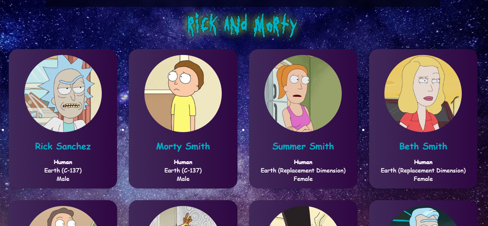

# Introdução a API

Este projeto é uma aplicação React que demonstra o uso de APIs para obter e exibir dados. Ele utiliza a biblioteca `axios` para fazer requisições HTTP a uma API pública de personagens do desenho "Rick and Morty". A aplicação exibe uma lista de personagens, incluindo suas imagens, nomes, espécies, origens e gêneros. Além disso, o projeto inclui uma breve explicação sobre o que são APIs e como elas funcionam.

## Como Executar

1. Clone o repositório:
  ```sh
  git clone https://github.com/MonicaAlvesP/introducao-api.git
  ```
2. Navegue até o diretório do projeto:
  ```sh
  cd introducao-api
  ```
3. Instale as dependências com Yarn ou NPM:

- Caso use Yarn:

```
  yarn
```

- Caso prefira o npm:

```
  npm install
```

4. Inicie o Servidor local:

- Com Yarn:

```
  yarn dev
```

- Com npm:

```
  npm run dev
```

## Tecnologias Utilizadas

- React
- Axios
- Vite
- Sass

## Funcionalidades

- Faz requisições HTTP para obter dados de uma API pública.
- Exibe uma lista de personagens do desenho "Rick and Morty".

## Demo do site

